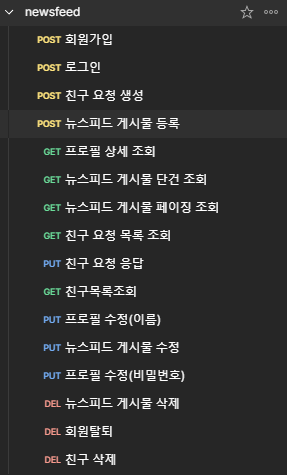

## 📁️ 뉴스피드 프로젝트, II

※ 간단한 SNS시스템 개발

- 로그인,회원가입,프로필관리,뉴스피드게시글관리,친구관리

## 🖥️ 팀원 소개

- 문정원, 김지혜, 이하승, 장용환

## 📚 담당 파트

- **문정원** : 친구요청생성, 친구요청응답API, 친구요청목록조회
- **김지혜** : 회원가입, 로그인, 프로필상세조회, 프로필수정(이름), 프로필수정(비밀번호)
- **이하승** : 게시물등록, 게시물단건조회, 게시물페이징조회, 게시물수정, 게시물삭제
- **장용환** : 친구삭제, 친구조회, 회원탈퇴

## 🛠️ 뉴스피드 설계서)

ㄴ 와이어프레임

ㄴ API명세서 상세

ㄴ [API명세서 링크](https://web.postman.co/workspace/d0e26f18-600f-4df1-8226-4463e76f38cb/collection/35385792-e156ca9d-e938-4f70-aa07-ac63c5987b48)

#

ㄴ ERD

## 🛠️ 프로젝트 기능 설명)

## 회원 정보)

#### 1)

- 할일제목, 할일내용 입력
- API경로 마지막에 일정ID를 넣어서 수정진행 (@PathVariable활용)
- 로그인한 토큰을 기준으로 회원의 권한을 조회하여 ADMIN일 경우에만 일정 수정 가능하도록 (@CookieValue)활용

## 프로필)

#### 1)

- 할일제목, 할일내용 입력
- API경로 마지막에 일정ID를 넣어서 수정진행 (@PathVariable활용)
- 로그인한 토큰을 기준으로 회원의 권한을 조회하여 ADMIN일 경우에만 일정 수정 가능하도록 (@CookieValue)활용

## 뉴스피드)

#### 1)

- 할일제목, 할일내용 입력
- API경로 마지막에 일정ID를 넣어서 수정진행 (@PathVariable활용)
- 로그인한 토큰을 기준으로 회원의 권한을 조회하여 ADMIN일 경우에만 일정 수정 가능하도록 (@CookieValue)활용

## 친구)

#### 1)

- 할일제목, 할일내용 입력
- API경로 마지막에 일정ID를 넣어서 수정진행 (@PathVariable활용)
- 로그인한 토큰을 기준으로 회원의 권한을 조회하여 ADMIN일 경우에만 일정 수정 가능하도록 (@CookieValue)활용

