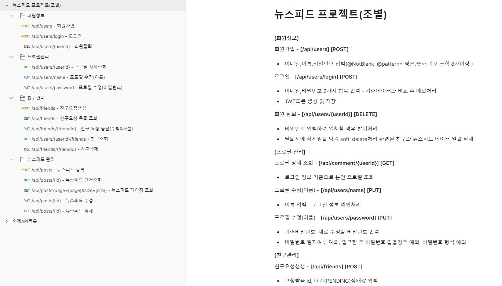
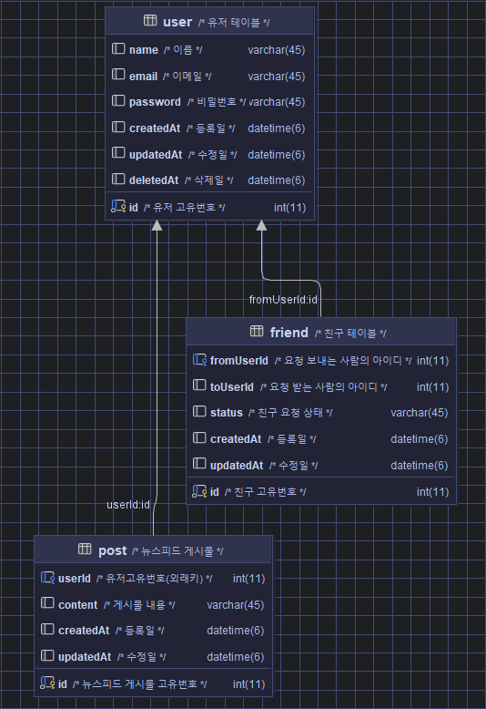

## 📁️ 뉴스피드 프로젝트 - II Team

※ 간단한 SNS시스템 개발

- 로그인,회원가입,프로필관리,뉴스피드게시글관리,친구관리

## 🖥️ 팀원 소개

- 문정원, 김지혜, 이하승, 장용환

## 📚 담당 파트

- **문정원** : 친구요청생성, 친구요청응답API, 친구요청목록조회
- **김지혜** : 회원가입, 로그인, 프로필상세조회, 프로필수정(이름), 프로필수정(비밀번호)
- **이하승** : 게시물등록, 게시물단건조회, 게시물페이징조회, 게시물수정, 게시물삭제
- **장용환** : 친구삭제, 친구조회, 회원탈퇴

## 🛠️ 뉴스피드 설계서)

ㄴ 와이어프레임

ㄴ API명세서 상세

ㄴ [API명세서 링크](https://web.postman.co/workspace/d0e26f18-600f-4df1-8226-4463e76f38cb/collection/35385792-e156ca9d-e938-4f70-aa07-ac63c5987b48)

#

ㄴ ERD

## 🛠️ 프로젝트 기능 설명)

## 1. 회원 정보)

#### 1-1. 회원가입)

- 이메일, 이름, 비밀번호입력
- 비밀번호 암호화처리
- 이메일 예외처리(중복된 이메일 및 이메일 형식 확인)

#### 1-2. 로그인)

- 이메일, 비밀번호 입력
- 이메일, 비밀번호 일치여부 확인, 탈퇴한 회원 체크
- 로그인 성공시 JWT 토큰 발급 및 저장 

#### 1-3. 회원탈퇴)

- 본인 비밀번호 입력하여 본인확인
- 탈퇴일을 남겨서 회원테이블에서 따로 관리
- 탈퇴됨과 동시에 관련 게시글과 친구데이터 전체 삭제

## 2. 프로필)

※ 로그인 정보 없을 경우 예외처리

#### 2-1. 상세조회)

- 로그인한 회원의 id로 회원정보 조회
- 이름, 이메일 노출

#### 2-2. 수정)

- 이름 별도 수정
- 비밀번호 수정 : 기존 비밀번호 입력하여 일치할 경우 수정
- 기존 비밀번호와 수정할 비밀번호가 같을 경우 예외처리

#### 2-3. 삭제)

- 본인 데이터만

## 3. 뉴스피드)

#### 3-1. 등록)

- 내용만 입력하고 로그인한 회원 고유번호(PK)받아서 데이터등록
- 내용 미입력 예외처리

#### 3-2. 단건조회)

- 토큰 없이 뉴스피드 게시글 조회가능
- 내용과 작성자 정보 노출

#### 3-3. 페이징조회)

- 생성일 기준 내림차순 조회
- 기본 게시글 수 10개

#### 3-4. 수정)

- 내용만 수정 / 회원 정보를 받아서 본인 게시글만 수정이 가능

#### 3-5. 삭제)

- 회원 정보를 받아서 본인 게시글만 삭제가 가능

## 4. 친구)

#### 4-1. 친구요청 생성)

- 요청하는 회원 고유번호(PK)와 요청 받는 회원의 고유번호(PK) 동시등록
- 등록시 PENDING(대기값)으로 등록
- 친구요청을 이미 보낸 경우 예외처리
- 이미 요청한 사람에게 중복으로 요청 보낼 경우 확인

#### 4-2. 친구 요청 응답)

- 대기값만 응답(수락&거절)이 가능하도록
- ACCEPT(수락), REJECT(거절)을 제외한 다른 값이 입력될시 예외처리

#### 4-3. 친구 요청 조회)

- 대기중이면서 본인이 받은 요청만 조회되도록

#### 4-4. 친구 조회)

- 로그인한 회원 고유번호(PK)로 조회
- ACCEPT의 값만 조회

#### 4-5. 친구 삭제)

- 친구 테이블의 고유번호(PK) 기준으로 삭제
- 본인의 친구만 삭제 되도록

